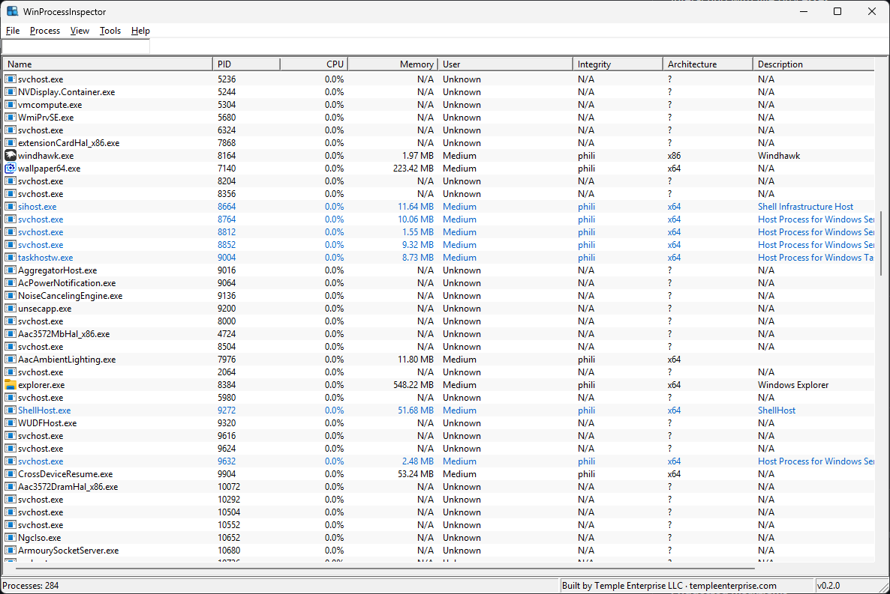

<p align="center">
  
</p>

<p align="center">
  
  
  
  
  
</p>

<p align="center">
  <b>A professional Windows system inspection tool for inspecting, monitoring,<br>and analyzing live processes, threads, memory, handles, and system resources.</b>
</p>

---

## ✨ Features

### Process & Thread Inspection
- Full process enumeration — PID, PPID, session, integrity level, architecture
- Thread enumeration per process with start addresses, states, and priorities
- Tree-view hierarchy showing parent–child process relationships
- Real-time process search and filtering

### Memory & Handle Analysis
- Virtual memory region enumeration with protection and usage details
- Handle enumeration — files, registry keys, mutexes, events, sections
- Per-process memory usage tracking with visual bar indicators

### Module Inspection
- Loaded DLL/module enumeration with base address, size, and file path
- Digital signature verification for detecting unsigned modules
- File description and company name extraction

### Security Analysis
- Access token inspection with privileges and group SIDs
- Integrity level visualization (System, High, Medium, Low, Untrusted)
- Process architecture detection (x86 vs x64)

### System Monitoring
- Per-process CPU usage with color-coded bar indicators
- Real-time memory usage tracking against total system memory
- Global system metrics and information dashboard
- Network connection monitoring
- Auto-refresh mode for continuous monitoring

### Process Management
- Suspend, resume, and terminate processes
- DLL injection with multiple injection methods
- Process priority and CPU affinity configuration
- Process memory dump creation
- Export process list to CSV, JSON, or plain text

---

## 📸 Showcase

<p align="center">
  
</p>

---

## 🏗️ Architecture

WinProcessInspector is built with a clean, modular, layered architecture:

| Layer | Description |
|---|---|
| **Core / Engine** | Windows API interaction — process, thread, module, memory, handle, and network enumeration |
| **Security** | Token, privilege, integrity level, and access-rights handling |
| **Injection** | DLL injection engine with multiple injection method support |
| **GUI** | Native Win32 presentation layer with ListView, toolbar, status bar, and dialogs |
| **Utilities** | Logging, error handling, and helper functions |

```
WinProcessInspector/
├── src/
│   ├── core/          # Process, Module, Memory, Handle, Network managers
│   ├── gui/           # MainWindow, ProcessPropertiesDialog
│   ├── injection/     # DLL injection engine
│   ├── security/      # Security and token management
│   └── utils/         # Logger and helper utilities
├── resources/         # Icons and application resources
└── WinProcessModule/  # Companion kernel-mode module (optional)
```

---

## 📋 Requirements

- **OS**: Windows 10 / 11 (x64)
- **Build Tool**: Visual Studio 2019 or later
- **SDK**: Windows SDK 10.0+
- **Configuration**: Release x64
- **Runtime**: Administrator privileges recommended for full process inspection

---

## 🚀 Build & Launch

### 1. Build the Executable
1. Open `WinProcessInspector.sln` in **Visual Studio**
2. Set the build configuration to **Release x64**
3. Build the solution — `Build` → `Build Solution` (or `Ctrl+Shift+B`)
4. Locate the compiled executable in `\x64\Release\`

### 2. Run WinProcessInspector
- Double-click `WinProcessInspector.exe` to launch
- **Recommended**: Run as Administrator for full access to all system processes
- The application will automatically enumerate running processes on startup

### 3. Explore
- Select any process from the list to inspect its runtime state
- Double-click or press **Enter** to open the full **Process Properties** dialog
- Right-click for quick context menu actions
- Use the **Filter** bar (`Ctrl+F`) to search processes by name

---

## ⌨️ Keyboard Shortcuts

| Shortcut | Action |
|---|---|
| `F5` | Refresh process list |
| `Enter` | Open process properties |
| `Ctrl+F` | Focus search / filter bar |
| `Ctrl+E` | Export process list |
| `Del` | Terminate selected process |
| `Alt+F4` | Exit application |

---

## 🤝 Contributing

Contributions are welcome! To contribute:

1. **Fork** the repository
2. **Create** a feature branch — `git checkout -b feature/your-feature`
3. **Commit** your changes — `git commit -m "Add your feature"`
4. **Push** to your branch — `git push origin feature/your-feature`
5. **Open** a Pull Request

Please ensure your code follows the existing style and builds without warnings.

---

<p align="center">
  Built by <a href="https://templeenterprise.com"><b>Temple Enterprise LLC</b></a>
</p>
